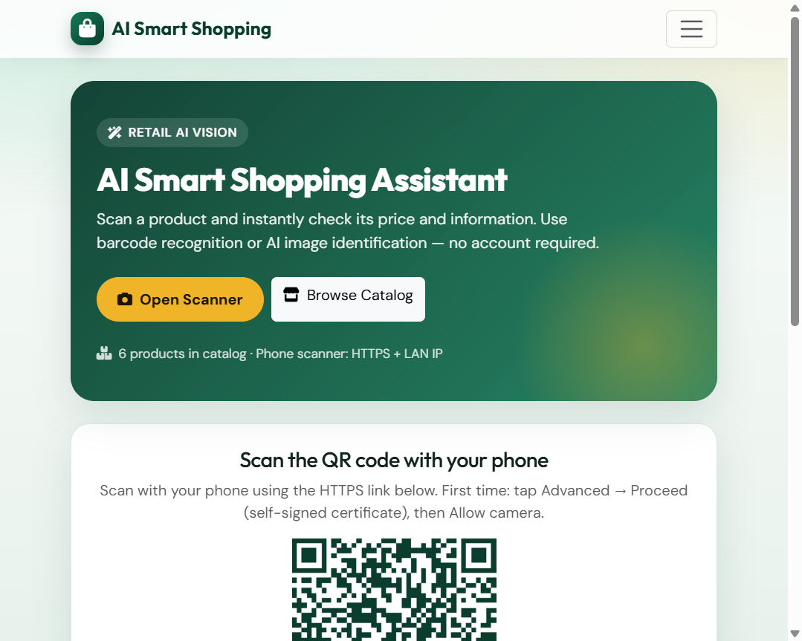
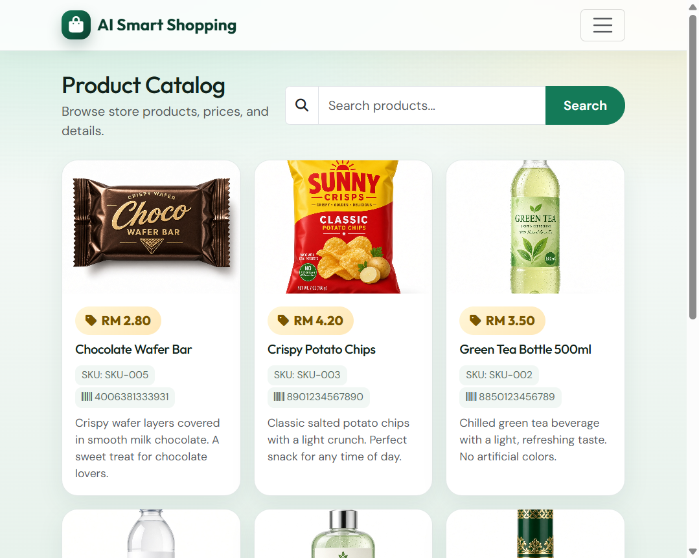
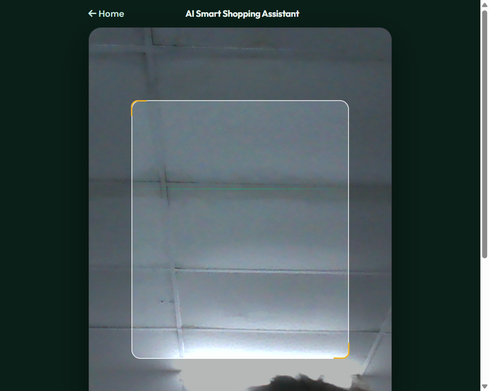
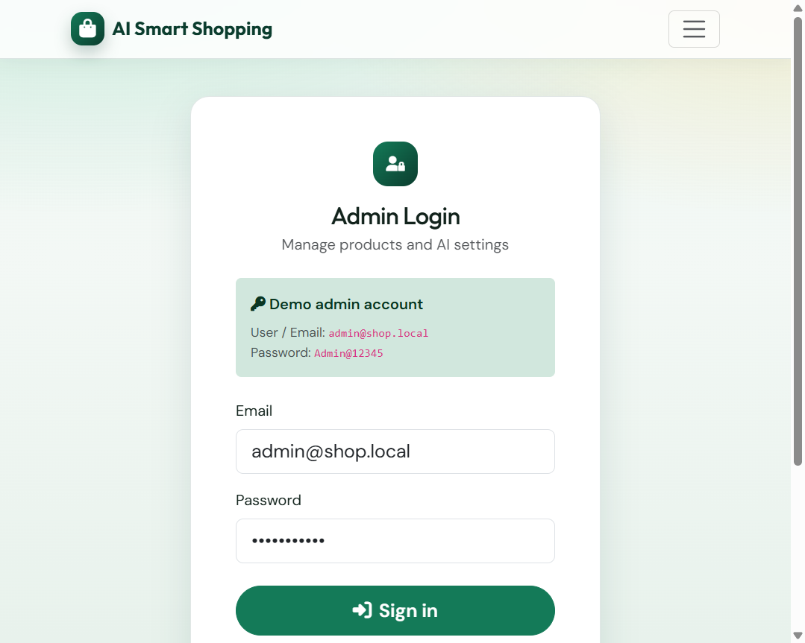
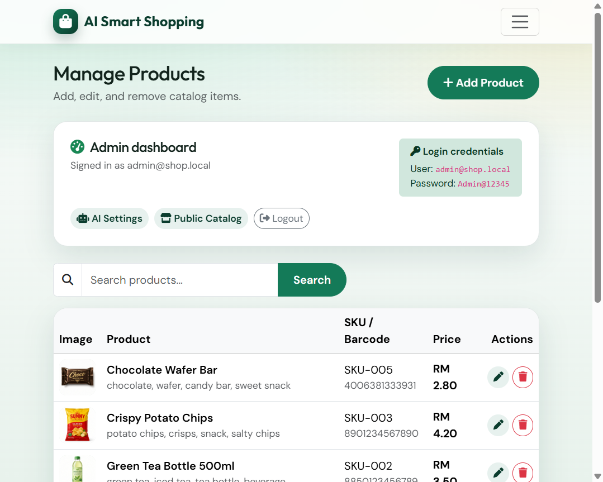
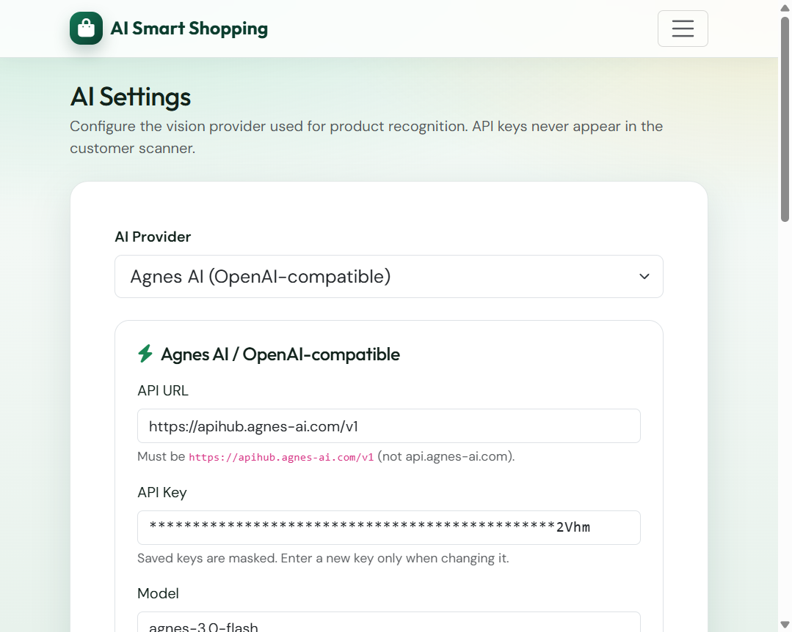

# AI Smart Shopping Assistant

A mobile-first PHP web app for retail demos: customers scan a QR code, open the camera scanner, identify products by **barcode** or **AI vision**, and see official catalog prices from MySQL.

[](LICENSE)
[](https://www.php.net/)
[](https://www.mysql.com/)

**Live demo:** [https://weihern.kolejsynergy.com/ai_shop_assistant_FULL/ai_shop_assistant/](https://weihern.kolejsynergy.com/ai_shop_assistant_FULL/ai_shop_assistant/)

---

## Screenshots

### 1. Home — QR entry for phones



### 2. Product catalog



### 3. Camera scanner (barcode + AI capture)



### 4. Admin login



### 5. Admin dashboard — manage products



### 6. AI settings (Agnes / Gemini)



---

## Features

- Customer scanner via QR (no account required)
- Live camera preview with rear/front switch
- Browser barcode detection (EAN / UPC / Code 128 / Code 39 via ZXing)
- AI image recognition through a secure PHP proxy
- Providers: **Agnes AI** (OpenAI-compatible) and **Google Gemini**
- Product catalog with search
- Admin CRUD, image uploads, AI connection test
- Prices always come from MySQL (never invented by AI)
- CSRF protection, password hashing, PDO prepared statements, secure uploads

---

## Tech stack

| Layer | Technology |
|-------|------------|
| Backend | PHP 8.3+, PDO, Sessions |
| Database | MySQL / MariaDB (utf8mb4) |
| Frontend | HTML5, CSS3, Vanilla JS, Bootstrap 5, Font Awesome |
| Camera | `getUserMedia` |
| Barcode | ZXing |
| QR | qrcodejs |

---

## Requirements

- PHP **8.3+** with `pdo_mysql`, `curl`, `gd`, `fileinfo`, `mbstring`, `json`
- MySQL 5.7+ / MariaDB 10.3+
- Apache with `mod_rewrite` (XAMPP / cPanel)
- HTTPS in production (camera APIs need a secure context)

---

## Quick start (XAMPP)

1. Copy this folder into your web root, e.g. `C:\xampp\htdocs\ai_shop_assistant\`
2. Start Apache + MySQL
3. Open `http://localhost/ai_shop_assistant/install.php`
4. Enter DB credentials and install
5. Open `http://localhost/ai_shop_assistant/`

Or import `sql/schema.sql` + `sql/seed.sql` in phpMyAdmin, then create empty `includes/install.lock`.

---

## Default admin login

| Field | Value |
|-------|-------|
| Email | `admin@shop.local` |
| Password | `Admin@12345` |

Change this password after first login.

---

## cPanel deployment

1. Upload the project to `public_html/ai_shop_assistant/` (or your path)
2. Create a MySQL database + user
3. Copy `includes/config.local.example.php` → `includes/config.local.php` and set DB credentials
4. Import `sql/cpanel_setup.sql` in phpMyAdmin **or** run `install.php`
5. Ensure PHP 8.3+ with `curl` / `openssl` enabled
6. Use HTTPS so phones can open the camera

See `CPANEL_DEPLOY.md` for host-specific notes.

---

## AI configuration

1. Admin → **AI Settings**
2. Choose **Agnes** or **Gemini**
3. Paste API URL, key, and model
4. Click **Test AI Connection**, then **Save**

API keys stay on the server and are never sent to the browser.

---

## Project structure

```text
ai_shop_assistant/
├── index.php              # Home + QR
├── scan.php               # Customer scanner
├── products.php           # Public catalog
├── login.php / logout.php
├── install.php
├── admin/
│   ├── products.php       # Product CRUD / dashboard
│   └── settings.php       # AI configuration
├── api/
│   ├── barcode.php
│   └── recognize.php
├── includes/              # Config, auth, AI, catalog
├── assets/                # CSS, JS, sample product images
├── docs/screenshots/      # README screenshots
├── uploads/products       # Uploaded product images
└── sql/                   # schema, seed, cPanel setup
```

---

## License

This project is released under the [MIT License](LICENSE).
